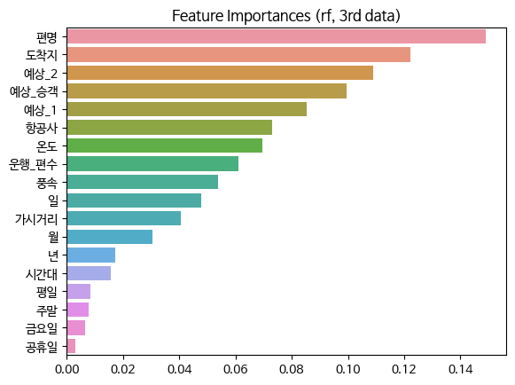
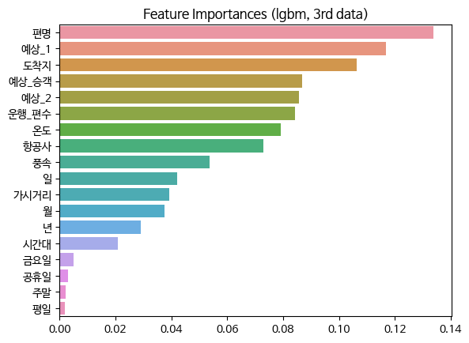
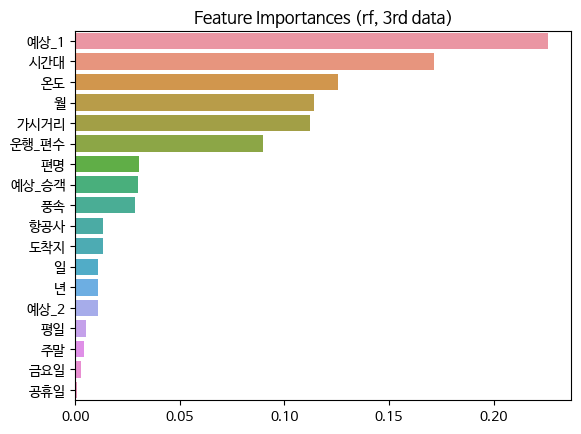
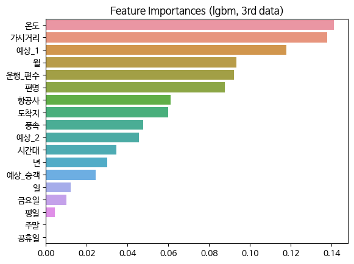

# AeroDelay

## 2023 Spring Machine Learning Team project: AeroDelay
* 프로젝트 개요: 머신러닝을 이용한 팀 프로젝트 제작
* 프로젝트 기간: 2023.04.14 ~ 2023.06.07
* 프로젝트 이름: AeroDelay
* 프로젝트 목표: 항공기의 출발 지연 여부를 예측하는 모델 제작

## AeroDelay

### Dataset configuration
* Train data: 2016~2018년 인천국제공항에서 출발(혹은 지연출발)한 모든 국제선
* Test data: 2019년 인천국제공항에서 출발(혹은 지연출발)한 모든 국제선
    * Covid-19에 의한 영향을 받기 전의 data를 사용하기 위함
* Train sample: 약 48만 개
* Test sample: 약 18만 개

### Dataset 
  0. 0th dataset: 항공정보포탈(https://airportal.go.kr)의 데이터 크롤링
  1. 1st dataset: 인천국제공항공사(https://www.airport.kr)의 데이터 추가
      * 시간별 복잡도 feature 추가
  2. 2nd dataset: 항공기상청(https://amo.kma.go.kr)의 데이터 추가
      * 가시거리, 온도, 풍속 feature 추가
  3. 3rd dataset: Holiday feature 추가
      * 평일과 주말을 구분하는 feature와 공휴일 feature 추가
      
### Models
* Random Forest, LightGBM 사용

### Results
0. 0th dataset

| Model         | Accuracy | F1-score |
|---------------|----------|----------|
| Random Forest | 0.822    | 0.859    |
| LightGBM      | 0.934    | 0.927    |

1. 1st dataset

| Model         | Accuracy | F1-score |
|---------------|----------|----------|
| Random Forest | 0.895    | 0.897    |
| LightGBM      | 0.910    | 0.905    |

2. 2nd dataset

| Model                       | Accuracy | F1-score |
|-----------------------------|----------|----------|
| Random Forest               | 0.929    | 0.909    |
| LightGBM                    | 0.877    | 0.886    |
| Random Forest (Grid search) | 0.940    | 0.911    |
| LightGBM (Grid search)      | 0.941    | 0.914    |

* Hyperparameter of Random Forest: 
* Hyperparameter of LightGBM: {'learning_rate': 0.05, 'max_depth': 5, 'min_child_samples': 250, 'n_estimators': 100, 'num_leaves': 63}

3. 3rd dataset (Final)

| Model                       | Accuracy | F1-score |
|-----------------------------|----------|----------|
| Random Forest               | 0.923    | 0.906    |
| LightGBM                    | 0.922    | 0.913    |
| Random Forest (Grid search) | 0.940    | 0.911    |
| LightGBM (Grid search)      | 0.941    | 0.912    |

* Hyperparameter of Random Forest: {'max_depth': 5, 'max_features': 'sqrt', 'min_samples_leaf': 1, 'min_samples_split': 5, 'n_estimators': 100}
* Hyperparameter of LightGBM: {'learning_rate': 0.05, 'max_depth': 2, 'min_child_samples': 250, 'n_estimators': 100, 'num_leaves': 31}

## Discussion

### 3rd dataset에서 grid search 유무에 따라 feature importance에 변동 발생
1. Feature importances without grid search

2. Feature importances with grid search

* 모델이 예측할 때 사용한 feature의 조합이 변동됨을 알 수 있다.

### 결론
* 특정 feature가 모델의 성능에 결정적인 영향을 미치는 것은 아니다.
* 그러나, 여러 feature의 조합을 이용하면 충분히 유효한 성능이 나온다.
* 따라서, 항공기 출발 시간 지연을 예측할 때 예상 출발시간, 예상 승객 수, 기상 정보 등을 복합적으로 고려해야 높은 정확도를 얻을 수 있다.

## Improvements
1. 성능에 유의미한 변동을 줄 수 있는 feature 탐색 → 해외 항공사의 기상 혹은 해외 공항의 혼잡도를 복합적으로 사용
2. 최신 dataset을 test data로 활용 → 인천국제공항에 다시 메일 보내서 요청하기
3. LightGBM에서 feature가 추가될수록 default model의 성능이 내려가는 이유 분석
